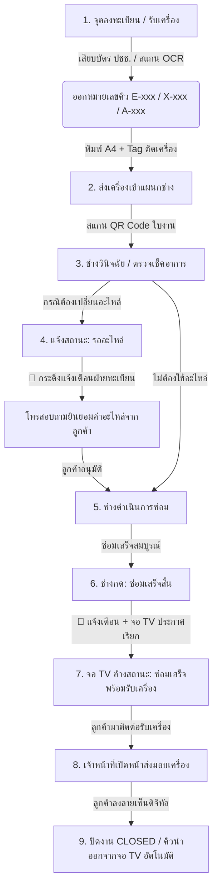

# 📖 คู่มือการใช้งานและเอกสารสถาปัตยกรรมระบบ
## NPC FixIt Center — Field Service Management (FSM) System
**วิทยาลัยสารพัดช่างน่าน สังกัดสำนักงานคณะกรรมการการอาชีวศึกษา (สอศ.)**

---

## 📌 สารบัญ (Table of Contents)
1. [ภาพรวมของระบบ (System Overview)](#1-ภาพรวมของระบบ-system-overview)
2. [สถาปัตยกรรมและโครงสร้างเทคโนโลยี (Architecture & Tech Stack)](#2-สถาปัตยกรรมและโครงสร้างเทคโนโลยี-architecture--tech-stack)
3. [การแบ่งสิทธิ์ผู้ใช้งาน (Role & Permission Matrix)](#3-การแบ่งสิทธิ์ผู้ใช้งาน-role--permission-matrix)
4. [ขั้นตอนการทำงานหลักของระบบงานซ่อม (End-to-End Workflow)](#4-ขั้นตอนการทำงานหลักของระบบงานซ่อม-end-to-end-workflow)
5. [คู่มือการใช้งานแต่ละโมดูล (Module Guides)](#5-คู่มือการใช้งานแต่ละโมดูล-module-guides)
   - [5.1 หน้าพอร์ทัลหลัก (Landing Portal)](#51-หน้าพอร์ทัลหลัก-landing-portal)
   - [5.2 ระบบลงทะเบียนงานซ่อม (Registration Module)](#52-ระบบลงทะเบียนงานซ่อม-registration-module)
   - [5.3 พื้นที่ปฏิบัติงานช่าง (Technician Workspace)](#53-พื้นที่ปฏิบัติงานช่าง-technician-workspace)
   - [5.4 กระดานแสดงคิวงานซ่อม Smart TV (Live Queue Board)](#54-กระดานแสดงคิวงานซ่อม-smart-tv-live-queue-board)
   - [5.5 ระบบครัวอาชีวะ ช่วยเหลือชุมชน (Relief Kitchen Module)](#55-ระบบครัวอาชีวะ-ช่วยเหลือชุมชน-relief-kitchen-module)
   - [5.6 แดชบอร์ดสถิติผู้บริหาร (Executive Dashboard)](#56-แดชบอร์ดสถิติผู้บริหาร-executive-dashboard)
   - [5.7 ศูนย์ควบคุมผู้ดูแลระบบ (Admin Console)](#57-ศูนย์ควบคุมผู้ดูแลระบบ-admin-console)
6. [ระบบความปลอดภัยและการคุ้มครองข้อมูลส่วนบุคคล (PDPA & Security)](#6-ระบบความปลอดภัยและการคุ้มครองข้อมูลส่วนบุคคล-pdpa--security)
7. [การติดตั้งและเริ่มใช้งานระบบ (Installation & Deployment)](#7-การติดตั้งและเริ่มใช้งานระบบ-installation--deployment)

---

## 1. ภาพรวมของระบบ (System Overview)
**NPC FixIt Center FSM System** เป็นระบบบริหารจัดการงานซ่อมสร้างภาคสนามแบบ Multi-Center ออกแบบมาเพื่อสนับสนุนภารกิจของศูนย์ซ่อมสร้างเพื่อชุมชน (FixIt Center) ของวิทยาลัยสารพัดช่างน่าน โดยช่วยจัดการกระบวนการตั้งแต่:
* การรับเรื่องและเสียบบัตรประชาชน / สแกน OCR ออกคิวงานซ่อม
* การพิมพ์ใบรับซ่อมราชการ (A4) และป้ายแท็กติดเครื่อง (Strip Tag)
* การทำงานแบบขนานของช่างหลายคนพร้อมกันใน 3 แผนกหลัก (ไฟฟ้า, อิเล็กทรอนิกส์, ช่างยนต์)
* การแจ้งเตือน Real-time เมื่อต้องเปลี่ยนอะไหล่ หรือซ่อมเสร็จสิ้น
* การแสดงผลกระดานคิว TV พร้อมเสียงเรียกภาษาไทยอัตโนมัติ
* การส่งมอบเครื่องคืนลูกค้าพร้อมบันทึกลายเซ็นดิจิทัล (Digital Handover)
* การบันทึกสถิติครัวอาชีวะจัดทำอาหารกล่องและเสบียงช่วยเหลือชุมชน

---

## 2. สถาปัตยกรรมและโครงสร้างเทคโนโลยี (Architecture & Tech Stack)

```
c:\xampp\htdocs\npc_fixitcenter\
├── apps/
│   ├── api/                 # NestJS 10 REST API + WebSocket Gateway (/ws)
│   │   ├── src/
│   │   │   ├── auth/        # Authentication (JWT + Passport + RBAC)
│   │   │   ├── customers/   # PII Encryption & Deduplication
│   │   │   ├── repair-orders/ # FSM State Machine & Handover
│   │   │   ├── queue/       # Atomic Queue Counter (Redis + PostgreSQL)
│   │   │   ├── dashboard/   # Aggregation Stats & Queue Board
│   │   │   ├── kitchen/     # Relief Kitchen Tracker
│   │   │   └── websocket/   # Socket.io Real-time Event Broadcaster
│   └── web/                 # Next.js 14 (App Router) Frontend
│       ├── src/
│       │   ├── app/         # Pages & Routes
│       │   ├── components/  # Reusable UI, QR Scanner, Signature Pad, Print Layouts
│       │   ├── store/       # Zustand Global Stores
│       │   └── lib/         # API Client & WebSocket Singleton
├── packages/
│   └── shared/              # Shared Types & DTOs
└── prisma/                  # PostgreSQL Schema, Migrations & Seeds
```

| Layer | เทคโนโลยี | รายละเอียดการใช้งาน |
|---|---|---|
| **Frontend** | Next.js 14 (App Router) | React 18, TypeScript, Tailwind CSS, shadcn/ui |
| **Backend** | NestJS 10 | TypeScript, Express, Helmet, Compression, Swagger |
| **Database** | PostgreSQL 15 | Prisma ORM 5 สำหรับ Relational Data & Migrations |
| **Cache / Queue** | Redis 7 | จัดการคิวงานซ่อมแบบ Atomic Counter ป้องกันเลขคิวซ้ำ |
| **Real-time** | Socket.io 4 | กระจาย Event อัปเดตสถานะคิว, การแจ้งเตือน Real-time |
| **Security** | AES-256-GCM + bcrypt | เข้ารหัสเลขบัตรประชาชน ชื่อ-สกุล ตามมาตรฐาน PDPA |
| **Voice Caller** | Web Speech API | สังเคราะห์เสียงภาษาไทยเรียกคิวอัตโนมัติ |

---

## 3. การแบ่งสิทธิ์ผู้ใช้งาน (Role & Permission Matrix)

| สิทธิ์ / บทบาท | รหัส Role | การลงทะเบียน & พิมพ์ใบงาน | พื้นที่ทำงานช่าง (ซ่อมงาน) | แก้ไขข้อมูลงานซ่อม | ลบข้อมูลงานซ่อม | จัดการศูนย์ & ผู้ใช้งาน (Admin) |
|---|---|:---:|:---:|:---:|:---:|:---:|
| **ผู้ดูแลระบบใหญ่ (Admin)** | `ADMIN` | ✅ | ✅ | ✅ | ✅ (เฉพาะ Admin) | ✅ |
| **ผู้ดูแลประจำศูนย์ (Supervisor)** | `SUPERVISOR` | ✅ | ✅ | ✅ | ❌ | ❌ |
| **ช่างซ่อม (Technician)** | `TECHNICIAN` | ❌ | ✅ | ❌ | ❌ | ❌ |
| **เจ้าหน้าที่รับแจ้ง (Registrar)** | `REGISTRAR` | ✅ | ❌ | ✅ | ❌ | ❌ |

---

## 4. ขั้นตอนการทำงานหลักของระบบงานซ่อม (End-to-End Workflow)



---

## 5. คู่มือการใช้งานแต่ละโมดูล (Module Guides)

### 5.1 หน้าพอร์ทัลหลัก (Landing Portal) — `/`
* **วัตถุประสงค์**: หน้าแรกสำหรับประชาชนและเจ้าหน้าที่ แสดงภาพรวมสถิติงานซ่อมและครัวอาชีวะทุกศูนย์บริการใน จ.น่าน
* **ฟีเจอร์เด่น**:
  * ตัวเลือกกรองดูสถิติแยกตามศูนย์บริการ
  * สถิติแยกตาม 3 แผนกช่าง (ไฟฟ้า, อิเล็กทรอนิกส์, ช่างยนต์)
  * สรุปยอดผลิตอาหารกล่อง น้ำดื่ม และเสบียงยังชีพ
  * ปุ่มลัดเข้าสู่จุดบริการต่างๆ

### 5.2 ระบบลงทะเบียนงานซ่อม (Registration) — `/registration`
* **แท็บ 1: ฟอร์มลงทะเบียน**:
  * **เครื่องอ่านบัตรประชาชน**: รองรับการอ่านข้อมูลจากบัตร Smart Card ดึงชื่อ นามสกุล เลขบัตร ปชช. 13 หลัก และที่อยู่อัตโนมัติ
  * **กล้องสแกน OCR**: สแกนข้อมูลจากบัตรประชาชนผ่านกล้องมือถือ/เว็บแคม
  * **แนบรูปถ่าย**: ถ่ายรูปบัตรประชาชน และถ่ายรูปสภาพเครื่องใช้ก่อนซ่อม
  * **การพิมพ์เอกสาร**:
    1. **ใบรับงานซ่อม (A4 Official Form)**: เอกสารแบบฟอร์มราชการ พร้อมเงื่อนไขการรับซ่อม และ QR Code
    2. **ป้ายแท็กติดเครื่อง (Device Strip Tag)**: ขนาดกะทัดรัด แถบยาวสำหรับตัดและติดบนตัวเครื่องใช้ มี QR Code หมายเลขคิว และช่องตัวเลขชัดเจน
* **แท็บ 2: ค้นหา & ตรวจสอบรายการลงทะเบียน**:
  * ค้นหาตามเลขคิว, ชื่อลูกค้า, เบอร์โทรศัพท์ หรือประเภทอุปกรณ์
  * ดูรายละเอียดและสถานะประวัติงานซ่อม
  * **ปุ่มแก้ไข (Edit ✏️)**: ใช้งานได้ทั้ง Admin, ผู้ดูแลศูนย์ และฝ่ายทะเบียน
  * **ปุ่มลบ (Delete 🗑️)**: สงวนสิทธิ์เฉพาะ **ผู้ดูแลระบบใหญ่ (Admin)** เท่านั้น

### 5.3 พื้นที่ปฏิบัติงานช่าง (Technician Workspace) — `/workspace`
* **การรับงาน**: ช่างเปิดกล้องสแกน QR Code จากป้ายแท็กติดเครื่อง หรือพิมพ์ค้นหาเลขคิว
* **การขยายดูภาพถ่ายเครื่อง**: มีระบบ **Image Lightbox** กดที่รูปถ่ายสภาพเครื่องเพื่อขยายใหญ่ ซูมเข้า-ออก (100%–400%) และหมุนภาพ 90° ได้
* **การเปลี่ยนสถานะ**:
  * `🔍 เริ่มตรวจเช็ค / วินิจฉัย (DIAGNOSING)`
  * `📦 รออะไหล่ / ขออนุมัติค่าใช้จ่าย (WAITING_PARTS)` — มีช่องกรอกรายการอะไหล่และราคา
  * `🔧 กำลังดำเนินการซ่อม (REPAIRING)`
  * `🎉 ซ่อมเสร็จสิ้น (COMPLETED)` — ส่งสถานะไปแจ้งเตือนส่งมอบเครื่องคืนลูกค้าทันที

### 5.4 กระดานแสดงคิวงานซ่อม Smart TV (Live Queue Board) — `/queue-board`
* **หน้าจอสำหรับเปิดบน Smart TV ประจำศูนย์**:
  * แสดงผล 3 แผนกช่าง (⚡ แผนกช่างไฟฟ้า, 💻 แผนกช่างอิเล็กทรอนิกส์, 🚗 แผนกช่างยนต์)
  * หมายเลขคิวแสดงใน **บรรทัดเดียว (Single-Line No Wrap)** สวยงาม คมชัด
  * **ระบบสไลด์วนคิวอัตโนมัติ (Auto-Carousel Rotation)**: หมุนเวียนเปลี่ยนคิวที่กำลังซ่อมทุก 4 วินาทีเมื่อมีช่างหลายคนซ่อมพร้อมกัน
  * **ระบบเสียงเรียกคิวภาษาไทย (Thai Voice Announcement 🔊)**: มีเสียง Ding-Dong + เสียงพูดเรียกคิวเมื่อเริ่มซ่อมหรือซ่อมเสร็จ
  * **ค้างคิวที่ซ่อมเสร็จแล้ว**: รายการที่ขึ้น `🎉 ซ่อมเสร็จ (พร้อมรับเครื่อง)` จะค้างแสดงอยู่บนกระดาน TV จนกว่าจะมีการเซ็นรับเครื่องจริง

### 5.5 ระบบครัวอาชีวะ ช่วยเหลือชุมชน (Relief Kitchen) — `/kitchen`
* บันทึกรายการแจกจ่าย: อาหารกล่องปรุงสุก, น้ำดื่ม, ถุงยังชีพ, ขนม/อาหารว่าง
* บันทึกภาพถ่ายกิจกรรม และระบุชุมชน/พื้นที่เป้าหมายที่ได้รับความช่วยเหลือ
* สรุปยอดรวมจำนวนชุดและผู้ได้รับประโยชน์แบบ Real-time

### 5.6 แดชบอร์ดสถิติผู้บริหาร (Executive Dashboard) — `/dashboard`
* สรุป KPI: ยอดรับซ่อมทั้งหมด, งานที่ซ่อมสำเร็จ, มูลค่าเชิงเศรษฐกิจที่ประหยัดได้ (Economic Value Saved)
* กราฟสัดส่วนงานซ่อมตามแผนกช่าง (Pie Chart) และแนวโน้มงานซ่อมรายวัน (Bar Chart)

### 5.7 ศูนย์ควบคุมผู้ดูแลระบบ (Admin Console) — `/admin`
* จัดการข้อมูลผู้ใช้งาน (เพิ่ม/แก้ไข/ระงับบัญชีผู้ใช้งาน)
* จัดการข้อมูลศูนย์บริการ (Service Centers) และภารกิจงานซ่อม (Missions)

---

## 6. ระบบความปลอดภัยและการคุ้มครองข้อมูลส่วนบุคคล (PDPA & Security)
1. **การเข้ารหัสข้อมูล PII**: เลขบัตรประจำตัวประชาชน 13 หลัก ชื่อ และนามสกุล ถูกเข้ารหัสด้วยอัลกอริทึม **AES-256-GCM** ก่อนบันทึกลงฐานข้อมูล
2. **การทำ Data Masking**: ในหน้าจอแสดงผลทั่วไป เลขบัตร ปชช. จะถูกปกปิดให้อยู่ในรูปแบบ `1-xxxx-xxxxx-xx-4` ตามมาตรฐาน PDPA
3. **ระบบสิทธิ์ RBAC (Role-Based Access Control)**: ตรวจสอบสิทธิ์ผ่าน JWT Guard และ Role Guard ทั้งใน Frontend และ Backend API
4. **Audit Trail**: บันทึกประวัติการกระทำสำคัญ เช่น การเปลี่ยนสถานะงานซ่อม การแก้ไขข้อมูล และการส่งมอบเครื่อง

---

## 7. การติดตั้งและเริ่มใช้งานระบบ (Installation & Deployment)

### 7.1 ความต้องการของระบบ (Prerequisites)
* Node.js ≥ 18.x
* pnpm ≥ 8.x (`npm install -g pnpm`)
* PostgreSQL ≥ 15
* Redis ≥ 7

### 7.2 คำสั่งเริ่มระบบ Development
```bash
# 1. ติดตั้ง Dependencies
pnpm install

# 2. เตรียมฐานข้อมูลและสร้างตาราง
pnpm db:generate
pnpm db:migrate
pnpm db:seed

# 3. เริ่มรันระบบแบบคู่ขนาน
pnpm dev
```

### 7.3 การ Build สำหรับ Production
```bash
pnpm build
pnpm start
```

### 7.4 การ Sync และ Push โค้ดขึ้น GitHub
```bash
# สั่ง Sync และ Push อัตโนมัติในคำสั่งเดียว
pnpm sync
```

---
*เอกสารนี้จัดทำขึ้นสำหรับโครงการระบบบริหารจัดการงานซ่อม NPC FixIt Center วิทยาลัยสารพัดช่างน่าน*
